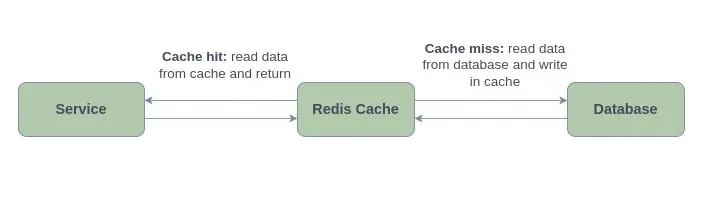

# REDIS (_Remote Dictionary Server_)

Remote Dictionary Server, aka Redis, an in-memory data store, is one of the many options for implementing caching in
Spring Boot applications due to its speed, versatility, and simplicity of use. It is a versatile key-value store that
supports several data structures, such as Strings, Sorted Sets, Hashes, Lists, Streams, Bitmaps, Sets, etc., because it
is a NoSQL database and doesn’t need a predetermined schema.

Redis can be used in various ways, including:

1) **In-Memory Database**: In today’s data-driven world, handling vast amounts of real-time data is a common challenge
   for
   businesses. A real-time database is a type of data repository designed to acquire, analyze, and/or augment an
   incoming stream of data points in real time, often immediately after the data is produced. Redis may be used to build
   data infrastructure for real-time applications that need high throughput and low latency.

2) **Cache**: Many applications struggle with the need to store and retrieve data quickly, especially in systems with
   high
   latency. Due to its speed, Redis is the ideal choice for caching API calls, session states, complex computations, and
   database queries.

3) **Message Broker (MQ)**: It has always been difficult to stream data around the organization and make it accessible
   for
   various system components. Redis supports messaging, event sources, alerts, and high-speed data intake using its
   stream data type.

### How Does Redis Caching Work?

Redis Cache effectively stores the results of database retrieval operations, allowing subsequent requests to retrieve
the data directly from the cache. This significantly enhances application performance by reducing unnecessary database
calls.

When a request is made, the service initially looks in the Redis cache for the desired data. When a cache hit occurs,
the data is swiftly retrieved from the cache and promptly provided back to the service, avoiding the need to interact
with the database.

However, if the requested data is not found in the cache (cache miss), the service intelligently falls back to the
database to retrieve the required information. Subsequently, the fetched data is stored in the Redis cache, enabling
future requests for the same data to be served directly from the cache, thereby eliminating further database queries and
speeding up overall response times.

Redis can also be used for deleting and updating tasks, guaranteeing consistent and latest data in the cache and further
boosting overall efficiency.

